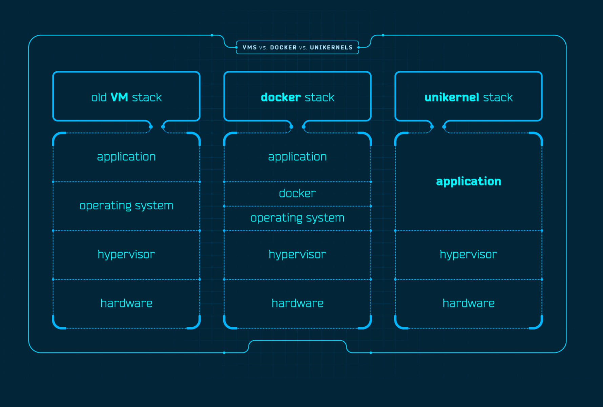
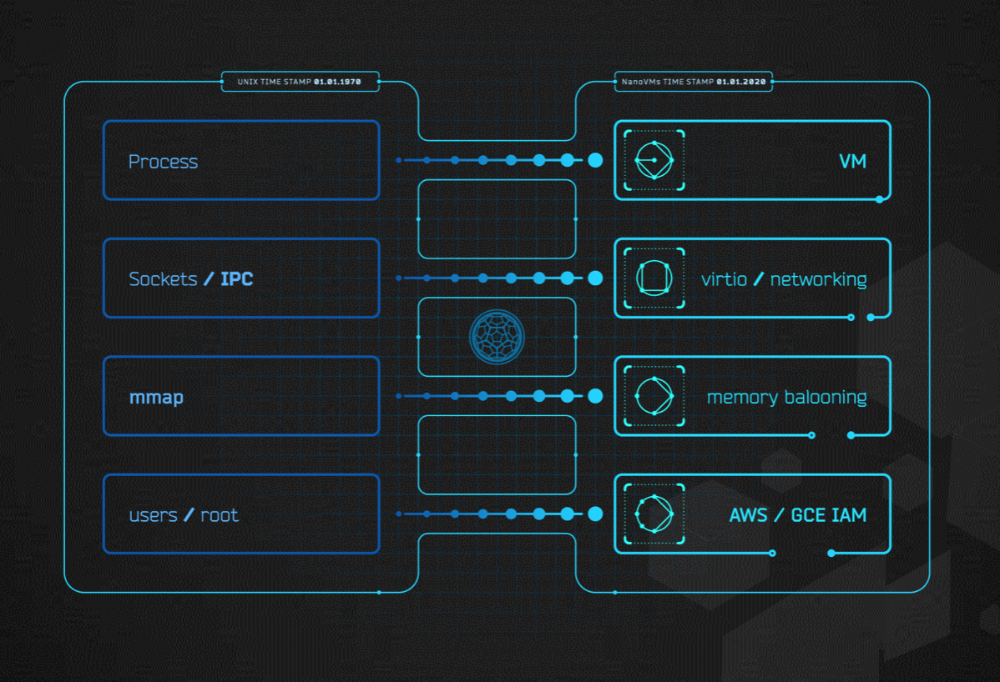

# OPS Documentation
This website contains documentation for [OPS](https://github.com/nanovms/ops), a
compilation and orchestration tool for the Nanos unikernel.

Most Unikernels out there are specialized for a high-level language, but Nanos
is capable of executing any valid ELF-binary. We provide pre-tested packages for
common linux software, including support for interpreted languages to
provide a similar Linux like experience.

OPS has packages for [PHP](examples.md),
[Node](examples.md), Ruby, Lua, Perl and much more. Note that
you are not required to use a package. OPS is explicitly built to be
able to run standalone static binaries such as Go and C.

This is a project that is being actively developed
and sponsored by [NanoVMs](https://www.nanovms.com).

#### What are Unikernels?
Unikernels are specialized single process operating systems.

Unikernels dramatically shrink the attack surface and resource footprint of
cloud services while providing a much better isolation model. They are machine
images that can be run on a hypervisor such as Xen or KVM. Since hypervisors
power all public cloud computing infrastructure such as Amazon EC2 and Google Cloud,
this lets your services run cheaper, more securely and with finer control than
with a full general purpose operating system such as Linux.

Unlike containers that add layers to the stack unikernels go the other
way and remove/compress layers of the stack:

##### Improved Security
Unikernels reduce the amount of code deployed, which reduces the attack surface,
and results in improved security. They also do not allow you to SSH into them
and most importantly they embrace the single process model.

**Note:** This does have implications for some software. See the [FAQ](faq.md)
for more details.

##### Small Footprints
Unikernel images are often orders of magnitude smaller than traditional OS
deployments. You can create and deploy sub-megabyte unikernels depending on
what you want/need.

##### Highly Optimized
Unikernels can achieve greater performance from their single process nature
and greater pairing with the kernel.

##### Fast Boot
Unikernels can boot extremely quickly, with boot times measured in milliseconds
if you are running on servers you control.

### Architecture

Unikernels are typically deployed directly to the cloud as native disk
images. For example on AWS when you do an 'ops image create' we create a
new AWS AMI every single time. That AMI when you spin it up with 'ops
instance create' spins up a new ec2 instance. This removes the need for
a complex orchestration system that you might be used to using with
something like kubernetes.

#### How do I Get Started?
To get started, go to the [Getting Started](getting_started.md) section.
