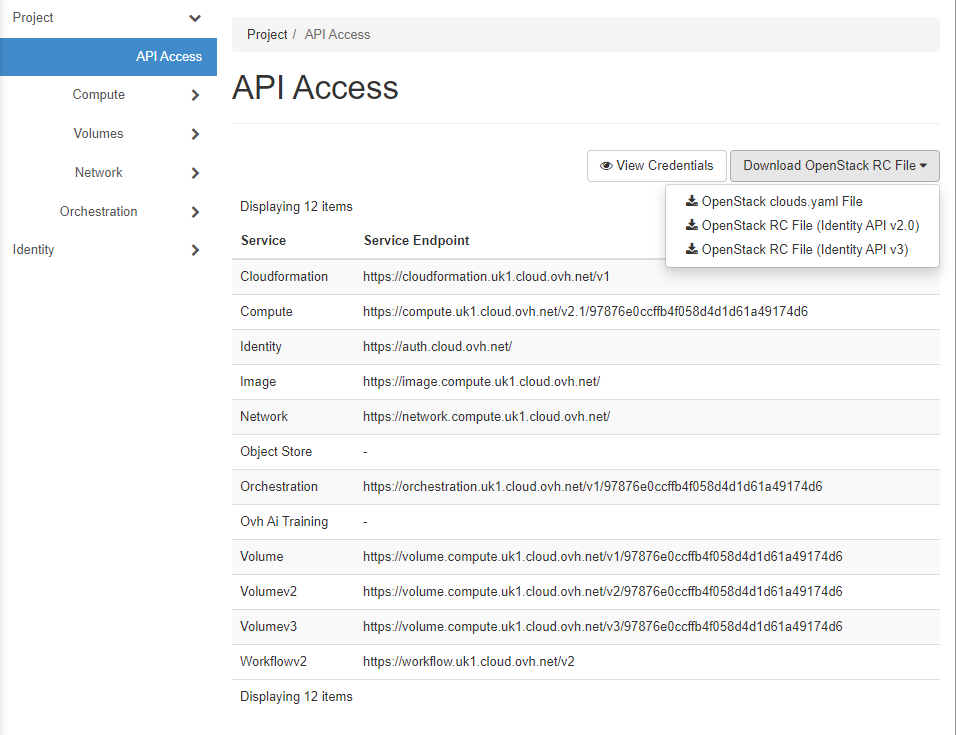

OpenStack Integration
========================

OPS works perfectly fine with OpenStack.

Some cloud providers using OpenStack that have been tested are [vexxhost](https://vexxhost.com/) and [ovh](https://www.ovh.com/).

In the cloud provider, download a script with the env variables required.
1. Create an account;
2. Login;
3. Click `API Access` in left menu;
4. Click on button with the description `Download OpenStack RC File`;
5. Select an option which contains the description `RC File`.

6. Run `RC file` script in the terminal where you will use ops.
```
$ ./6050015361872676-openrc.sh`
```

Alternatively, you can set the env variables manually.
```
export OS_USERNAME=""
export OS_PASSWORD=""
export OS_DOMAIN_NAME="Default"
export OS_AUTH_URL="https://auth.vexxhost.net/"
export OS_REGION_NAME="sjc1"
export OS_PROJECT_NAME=""
export OS_PROJECT_ID=""
```

## Image Operations
### Create Image

```sh
GOOS=linux go build -o <image_name>

ops image create -c config.json -t openstack -a <image_name>
```

### List Images

```sh
ops image list -t openstack
```

### Delete Image

```sh

ops image delete -t openstack <image_name>
```

## Instance Operations
### Create Instance

```sh

ops instance create -t openstack -i <image_name>
```

While creating instance on openstack OPS needs flavour name. If you don't provide, OPS selects one for you. You can provide flavor name via CLI and config file.

CLI example

```sh
ops instance create -t openstack -a <image_name> -f <flavor_name>
```

Sample config file
```json
{
  "CloudConfig" :{
    "Platform" : "openstack",
    "flavor" : "<flavor_name>"
  }
}
```
OPS provides configurable instance volume size. Add volume size in config file. Default size is 1 GB.
``` json
{
    "RunConfig": {
        "VolumeSizeInGb" : 2
    }
}
```
### List Instances

```sh
ops instance list -t openstack
```

### Get Logs for Instance

```sh
ops instance logs -t openstack <instance_name>
```

### Delete Instance
```sh
ops instance delete -t openstack <instance_name>
```
You can fetch instance name from **ops instance list** command.

## Volume Operations
### Create Volume

```sh

ops volume create -t openstack <volume_name>
```

### List Volumes

```sh
$ ops volume list -t openstack
+--------------------------------------+------+-----------+-----------+----------+-------------------------------+----------+
|                 UUID                 | NAME |  STATUS   | SIZE (GB) | LOCATION |            CREATED            | ATTACHED |
+--------------------------------------+------+-----------+-----------+----------+-------------------------------+----------+
| 2977268e-7c83-4191-a30d-f6fa25c3ddab |      | available |         1 |          | 2021-02-24 13:24:54 +0000 UTC |          |
+--------------------------------------+------+-----------+-----------+----------+-------------------------------+----------+
```

### Delete Volume

```sh
ops volume delete -t openstack <volume_name>
```

### Attach Volume

```sh
ops volume attach -t openstack <instance_name> <volume_name> <mount_path>
```

### Detach Volume

```sh
ops volume detach -t openstack <instance_name> <volume_name>
```
