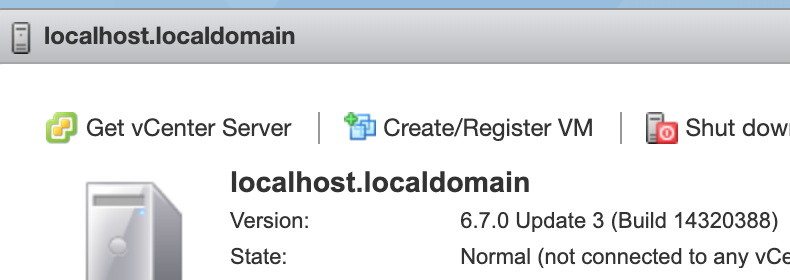

Vsphere Integration
========================

OPS works perfectly fine with VSphere ESX 6.7 and 7.0.

It uses the pvsci driver for storage and vmnetx3 for networking.

For most operations you'll want to use the following config and you'll
need access to your API key and the access key and secret access key
found in your portal:

```json
{
  "CloudConfig" :{
    "BucketName":"nanos-test"
  }
}
```

```sh
package main

import (
  "fmt"
  "net/http"
)

func main() {
  fmt.Println("hello world!")

  http.HandleFunc("/", func(w http.ResponseWriter, r *http.Request) {
    fmt.Fprintf(w, "Welcome to my website!")
  })

  fs := http.FileServer(http.Dir("static/"))
  http.Handle("/static/", http.StripPrefix("/static/", fs))

  http.ListenAndServe("0.0.0.0:8080", nil)
}
```

## Image Operations
### Create Image

This creates a monolithicFlat image (2 files) and uploads it to
vsphere's datastorage.

```sh

export GOVC_INSECURE=1
export GOVC_URL="login:pass@host:port"

GOOS=linux go build -o gtest

ops image create gtest -c config.json -t vsphere

```

### List Images

```sh
export GOVC_INSECURE=1
export GOVC_URL="login:pass@host:port"

ops image list -t vsphere
```

### Delete Image

## Instance Operations
### Create Instance

The domain part of the Resource Pool is in this example, 'localhost.localdomain'. You can find that in your portal.



```sh
export GOVC_INSECURE=1
export GOVC_URL="login:pass@host:port"
export GOVC_RESOURCE_POOL="/ha-datacenter/host/localhost.localdomain/Resources"

ops instance create gtest -t vsphere
```

### Start an Instance

```sh
export GOVC_INSECURE=1
export GOVC_URL="login:pass@host:port"

ops instance start mytest -t vsphere
```

### List Instances

```sh
export GOVC_INSECURE=1
export GOVC_URL="login:pass@host:port"

ops instance list -t vsphere
```

Note: The first time you run this command you might need to have the
Guest IP Hack set. OPS will try to set that automatically for you but
all existing vms won't report their ips until it is set *and* will
require a new ARP request to be sent. If you already know the ip in
question you can simply connect to it or you can reboot the vm and that
will generate traffic.

### Get Logs for Instance

You can obtain the logs via:

```
export GOVC_INSECURE=1
export GOVC_URL="login:pass@host:port"

ops instance logs -t vsphere gtest
```

### Delete Instance

Right now the delete instance deletes both the instance and the image.
We will probably change this in the future to do just the instance.

```sh
export GOVC_INSECURE=1
export GOVC_URL="login:pass@host:port"
export GOVC_RESOURCE_POOL="/ha-datacenter/host/localhost.localdomain/Resources"

ops instance delete -t vsphere named
```
